# Creating a Ruby gem
> A simple step by step guide to create a ruby gem 

When you find yourself coding something that can solve a common problem and realize that someone else could take advantage of that same code to speed up their solution, that’s the right moment for creating a gem. At least that’s a gem’s purpose. Actually you could create one about whatever subject you want, it doesn't matter if it doesn’t solve a real problem, the option is there.

## The Process

### Choosing the name
One of the most simple things while coding, but complicated at a time, is choosing the right name of our elements. Naming is really important because it could guide someone interested in your code to realize what it is about, without actually looking at it in detail.

That’s why a good naming structure is a substantial part of writing code. There is no difference on writing a gem, since each one must have a unique name. A meaningful and descriptive name will be more attractive and it’ll catch more sights of developers who are looking for a gem. Take advantage of that. As an example I’m going to use hola_brightcoders as the name of my gem. 
Once you’ve choosen your gem’s name you have to be sure that nobody else is having a gem with the same name, to validate it we have different options:

#### Using the gem command
Using the terminal we enter the next command: `% gem list gem-name -r` where gem-name is your gem’s name.

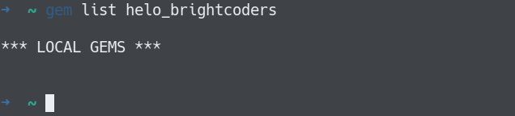

This command will show you any other gem that its name matches, or part of it, with the name you are searching for.

#### Using RubyGems website
Access the [RubyGems](https://rubygems.org/) website and verify that there’s no other gem using the same name.

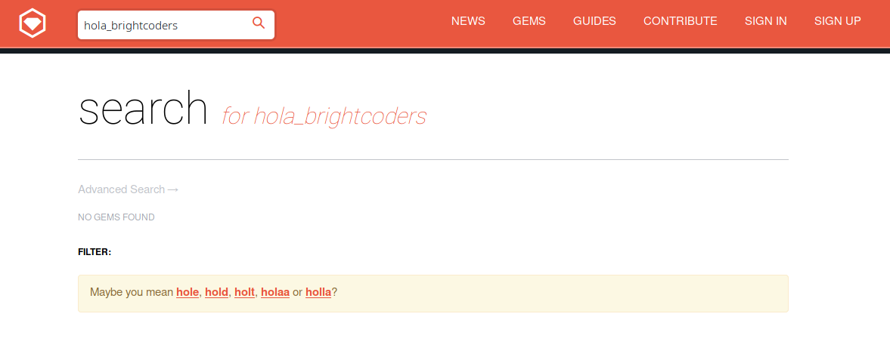

### The license
You have to think about what license fits better on your needs in order to let other people know how they can use your gem. Adding a “readme.md” is a crucial part when publishing or sharing code with others. Doing this anyone knows, at least, what your gem does and how to work with it.

### File structure
We’re going to start creating a root directory and once inside it create a **gemspec** file and a directory called lib, entering the next commands in terminal: 
`% mkdir hola_brightcoders` 
`% cd hola_brightcoders` 
`% touch hola_brightcoders.gemspec` 
`% mkdir lib` 
`% touch lib/hola_brightcoders.rb` 
After it we should have the next file structure:

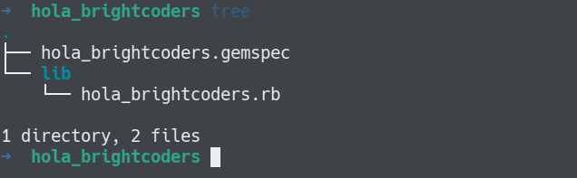

Our program’s code must be placed into the lib directory. The norm says that the main file of the program should share the same name with our gem, because this is the first to be loaded when someone uses the gem.
In this case the **lib/hola_brightcoders.rb** code is just a simple implementation of a method that outputs a string as a message:

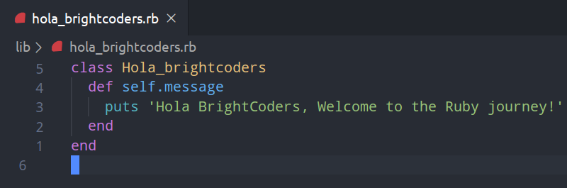

The **hola_brightcoders.gemspec** is going to be the interface with [rubygems.org](https://rubygems.org/), since we’ll use it to build, install and publish our gem. Here we have to set the required attributes, which are: 
- **files**
- **name**
- **author=** or **authors=** 
- **summary**
- **version**

There are 2 attributes that will throw a warning if they’re not present:
- **homepage** - website for your gem
- **license** - How other people can use your gem 

There’s also many recommended attributes, some of them are:
- **description** 
- **email**
- **homepage**
- **license=** or **licenses=**
- **metadata**

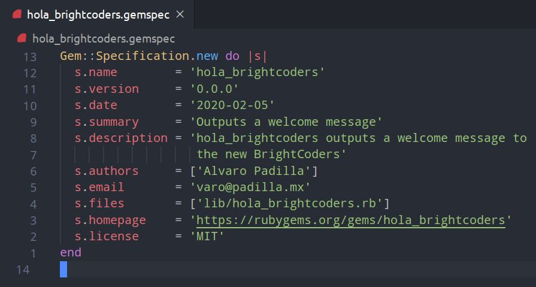

There are so many other attributes that can be included in a **gemspec** file. Check the complete list of [attributes](https://guides.rubygems.org/specification-reference/).

### Building the gem
Once we complete the previous steps we could proceed to build the gem:

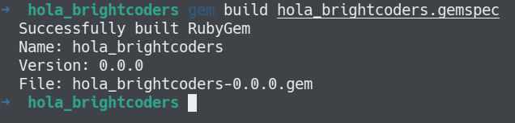

### Installing the gem 
Now we can install it:

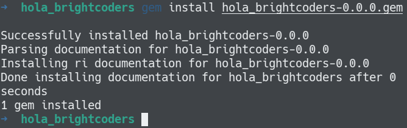

### Using it 
Finally we can require the gem to use it. Here we use **irb** to test it, but it can be included in any other program, just `require` it: 

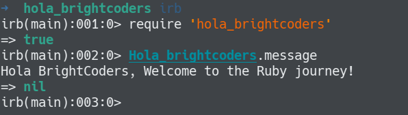

### Adding more files
When it comes to a more complex gem with more functionalities, and hence, the need of adding more files, we need to modify our file structure by adding a new directory where we must place those new files. The name of this directory is the same as the gem, and it is created inside **lib**. We are going to create a new class which is an extension of our ‘hola_brightcoders’ class and `require` it from the former class so it can be loaded and ready to use when needed.
This new class is called `Welcome_team` and it outputs a welcome message to a given team:

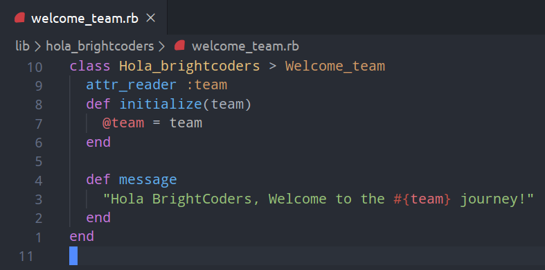

The file structure now should look like this:

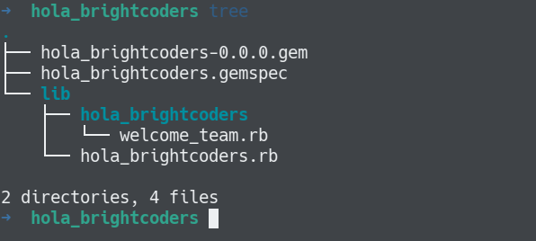

Since we have created a new file, we have to let the gem know about it, in order to do that we have to add it into the files attribute at the **gemspec** file: 

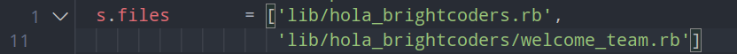

Now we can test this new functionality on **irb**:

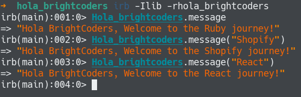

### Writing tests
This is actually one of the most important steps while creating a gem, since other developers might use those tests as a reference to be sure that the gem does what it says. Tests can be included in the gem package, thereby anyone can run them after download it. 

To implement our tests we are going to use a Ruby’s built-in test framework called **Minitest**. We have to modify the file structure again to include test files, adding into the root directory a new directory and a file called test and **Rakefile** respectively:

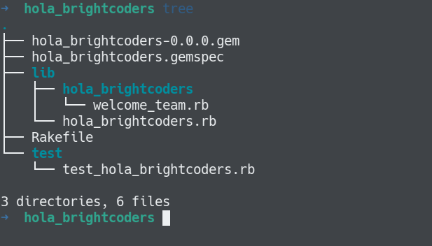

The **Rakefile** only has some settings in order to automate the test process:

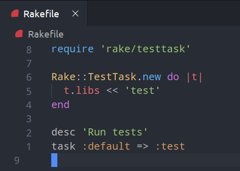

This is the file for a simple test of our gem:

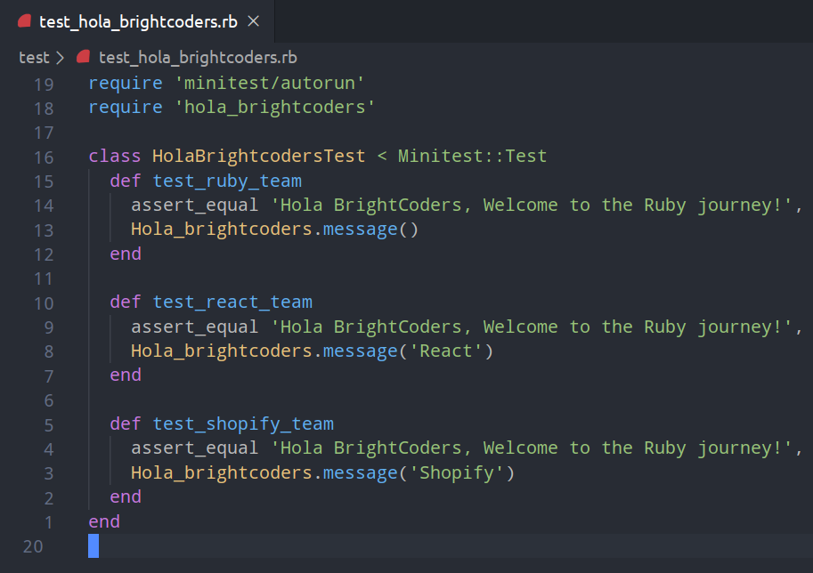

Now we simply enter `% rake test` in terminal to run the test:

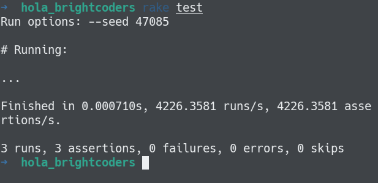

And that’s it! We now have a complete gem.

### Credits
A detailed guide about this topic can be found in this link: https://guides.rubygems.org/make-your-own-gem/# 
Also these other posts on medium are so helpful: 
https://medium.com/life-opw/make-your-own-gem-d78b41953111 
https://medium.com/codezillas/how-to-make-a-ruby-gem-79938dfeef58 
https://medium.com/swlh/create-a-simple-ruby-gem-1b470c4145bd

### License
MIT
